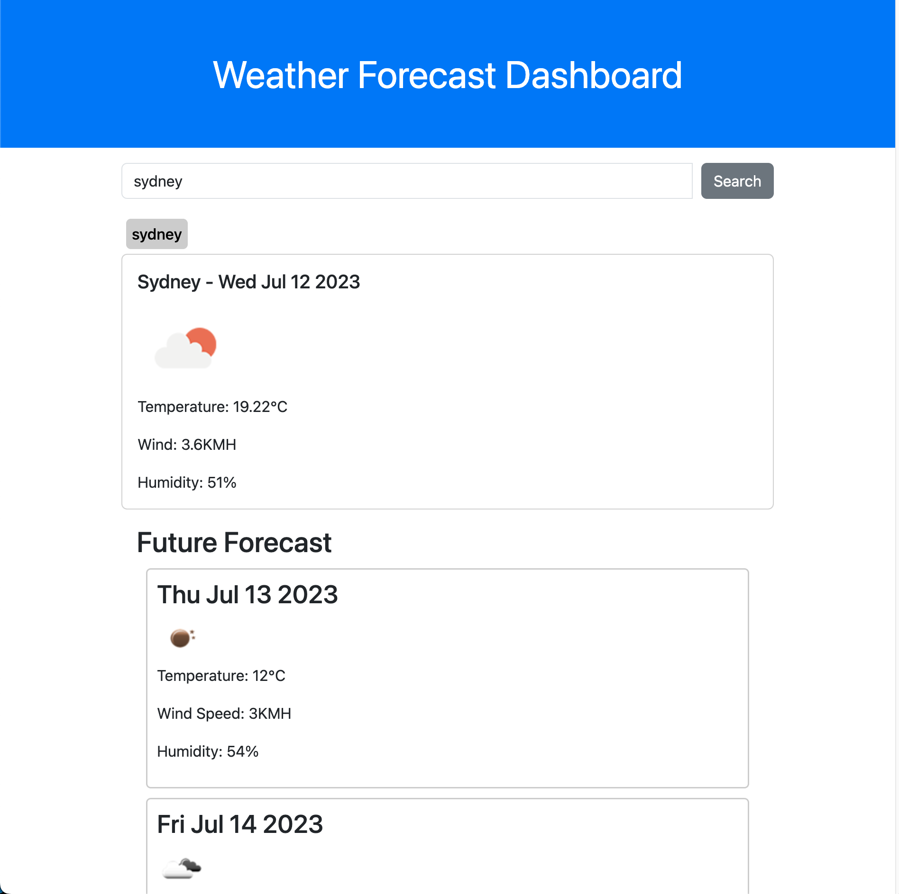

# <Weather-Dashboard>

## Description

This project worked with the Open weather API to provide the weather of major cities and their 5 day forecast. In attempting to build this project it forced me to look at the documentation in order to fetch the necessary data but also with the correct metrics. Furthermore it helped me work on better building dynamic layouts for projects. It helped me learn the importance of reading the DOM returned from a fetch request, how to access it and then to display it too the user. Admittedly I did find the assessment the most challenging, especially the future forecast. Furthermore the previous group assessmant helped me build my local storage function which displays the 3 buttons of recent seach history.

## Usage

Link to live page: https://nikoauer.github.io/Weather-Forecast-Dashboard/

## Resources-used

- https://openweathermap.org/forecast5
- https://openweathermap.org/current
- https://www.w3schools.com/
- https://developer.mozilla.org/en-US/docs/Web/API/Fetch_API/Using_Fetch
- https://stackoverflow.com/